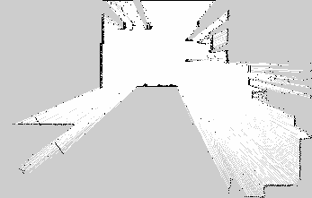
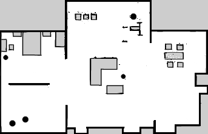
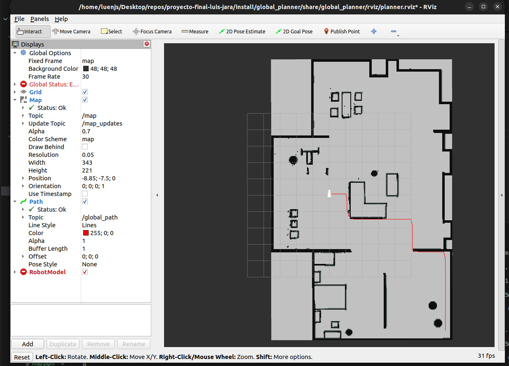

# Planificación Global con Dijkstra - Robot Cuadrúpedo Unitree Go2

## Descripción del Proyecto

Este proyecto implementa un sistema completo de navegación autónoma para el robot cuadrúpedo Unitree Go2 en entorno simulado (Gazebo). El sistema integra dos componentes principales: generación de mapas mediante SLAM y planificación de trayectorias globales usando el algoritmo de Dijkstra implementado desde cero.

---

## Componentes del Proyecto

### 1. Mapeo con SLAM
Generación automática del mapa 2D del entorno usando SLAM Toolbox con el robot Unitree Go2 equipado con un LIDAR Velodyne.

### 2. Planificación Global
Cálculo de trayectorias óptimas usando el algoritmo de Dijkstra sobre el mapa de ocupación generado, creando waypoints navegables para el robot.

### 3. Control de Trayectorias con PID
Seguimiento autónomo de la trayectoria planificada mediante un controlador PID que ajusta las velocidades lineal y angular del robot en tiempo real.

---

## Instalación

### Requisitos del Sistema

**Sistema Operativo:**
- Ubuntu 22.04 LTS (Jammy Jellyfish)

**Software Base:**
- ROS 2 Humble Hawksbill
- Gazebo 11
- Python 3.10+

### Instalación de Dependencias

**1. Tener previamente instalado ROS 2 Humble:**

**2. Instalar paquetes ROS 2 necesarios:**

```bash
# Dependencias del robot Unitree Go2
sudo apt install -y \
  ros-humble-gazebo-ros2-control \
  ros-humble-xacro \
  ros-humble-robot-localization \
  ros-humble-ros2-controllers \
  ros-humble-ros2-control \
  ros-humble-velodyne \
  ros-humble-velodyne-gazebo-plugins \
  ros-humble-velodyne-description

# Dependencias para navegación y mapeo
sudo apt install -y \
  ros-humble-gazebo-ros-pkgs \
  ros-humble-navigation2 \
  ros-humble-nav2-bringup \
  ros-humble-slam-toolbox \
  ros-humble-joint-state-publisher \
  ros-humble-joint-state-publisher-gui \
  ros-humble-rviz2
```

**3. Instalar herramientas de desarrollo:**

```bash
sudo apt install -y \
  python3-colcon-common-extensions \
  python3-rosdep \
  git
```

**4. Instalar paquetes Python:**

```bash
pip3 install numpy
```

### Clonar y Compilar el Proyecto

**1. Clonar el repositorio:**

```bash
cd ~
git clone https://github.com/luisenjs/proyecto-final-luis-jara.git
cd proyecto-final-luis-jara
```

**2. Inicializar rosdep (solo la primera vez):**

```bash
sudo rosdep init
rosdep update
```

**3. Instalar dependencias del proyecto:**

```bash
rosdep install --from-paths src --ignore-src -r -y
```

**4. Compilar el workspace:**

```bash
colcon build
```

**5. Cargar el entorno:**

```bash
source install/setup.bash
```

### Verificación de la Instalación

Verifica que todo esté instalado correctamente:

```bash
# Verificar ROS 2
ros2 --version

# Verificar que los paquetes se compilaron
ros2 pkg list | grep -E "global_planner|go2_config"

# Verificar Gazebo
gazebo --version
```

Si todos los comandos se ejecutan sin errores, la instalación fue exitosa y puedes proceder al mapeo y planificación.

---

## Mapeo del Entorno

### Mapa Generado por SLAM

El siguiente mapa fue generado usando **SLAM Toolbox** en el mundo `small_house` de AWS RoboMaker:



> **⚠️ Problema Identificado**: Durante el proceso de mapeo se detectó un problema crítico con los marcos de referencia en RViz. Al mover el robot con teleoperación, el mapa se desplaza según se mueve el robot en lugar de mantenerse fijo, generando un mapeo incorrecto y sobrepuesto.

### Video del Proceso de Mapeo

📹 **[Ver video del mapeo en YouTube](TU_LINK_AQUI)**

El video muestra el comportamiento errático del mapeo donde:
- El robot rota en su posición para escanear el entorno inicialmente
- El mapa se genera pero con desplazamiento continuo

### Mapa Corregido Manualmente

Debido a los problemas de mapeo, se realizó una corrección manual del mapa basándose en las lecturas parciales del LIDAR:



**Proceso de corrección:**
1. Se tomó como base el mapa generado por SLAM con rotaciones estacionarias
2. Se completaron las zonas faltantes usando la información del entorno en Gazebo

### Proceso de Mapeo

**Comandos utilizados:**

```bash
# Terminal 1 - Lanzar Gazebo con robot y LIDAR
ros2 launch go2_config gazebo_velodyne.launch.py world:=small_house

# Terminal 2 - Lanzar SLAM Toolbox
ros2 launch go2_config slam.launch.py use_sim_time:=true

# Terminal 3 - Teleoperación del robot
ros2 run teleop_twist_keyboard teleop_twist_keyboard

# Guardar el mapa generado
cd images/mapping
ros2 run nav2_map_server map_saver_cli -f map_slam
```

### Créditos del Mapeo

- **Robot**: Unitree Go2 - Modelo URDF y configuración obtenida del repositorio [unitree-go2-ros2](https://github.com/widegonz/unitree-go2-ros2)

---

## Planificación Global de Trayectorias

### Visualización de la Planificación

La siguiente imagen muestra la trayectoria planificada usando el algoritmo de Dijkstra sobre el mapa corregido manualmente:



*La trayectoria en rojo representa el camino óptimo calculado desde la posición actual del robot hasta el objetivo definido en RViz usando la herramienta "2D Goal Pose".*

### Implementación del Algoritmo de Dijkstra

El algoritmo de Dijkstra se implementó desde cero en Python para calcular el camino más corto entre dos puntos en el mapa de ocupación 2D.

**Principio de funcionamiento:**

```python
1. Inicializar cola de prioridad con posición inicial (costo = 0)
2. Mientras la cola no esté vacía:
   a. Extraer celda con menor costo acumulado
   b. Si es el objetivo, reconstruir y retornar camino
   c. Para cada vecino navegable (4-conectividad):
      - Calcular nuevo costo
      - Si es mejor que el conocido, actualizar y agregar a cola
3. Si no se encuentra camino, retornar None
```

**Archivo principal:** `src/global_planner/global_planner/global_planner_dijkstra.py`

**Características de la implementación:**

- **Conectividad**: 4-vecinos (arriba, abajo, izquierda, derecha)
- **Costo**: Uniforme (costo = 1 por movimiento)
- **Estructura de datos**: `heapq` para cola de prioridad
- **Conversión de coordenadas**: Métodos para transformar entre coordenadas del mundo (metros) y celdas del mapa

**Complejidad computacional:**
- **Tiempo**: O((V + E) log V) donde V = número de celdas (~75,803 para mapa 343×221)
- **Espacio**: O(V) para almacenar costos, padres y cola de prioridad

### Generación de Waypoints

El planificador genera waypoints (puntos de ruta) espaciados uniformemente a lo largo de la trayectoria calculada.

**Parámetros de waypoints:**

```python
WAYPOINT_SPACING = 0.5  # metros entre waypoints
```

**¿Por qué 0.5 metros?**

1. **Resolución del mapa**: Con resolución de 0.05m/celda, 0.5m = 10 celdas, lo cual es suficiente para capturar cambios de dirección sin sobresaturar la lista de waypoints.

2. **Control del robot**: Un espaciado de 0.5m permite que el controlador del robot tenga tiempo suficiente para ajustar su trayectoria entre waypoints consecutivos.

3. **Eficiencia computacional**: Reducir el número de waypoints (vs. publicar cada celda del camino) minimiza la carga de procesamiento y comunicación en ROS 2.

4. **Suavizado implícito**: Al espaciar los waypoints, se reduce el efecto "escalonado" de seguir la grilla estrictamente, aunque el camino sigue siendo subóptimo en cuanto a suavidad.

**Proceso de generación:**

```python
def generate_waypoints(path, spacing=0.5):
    """
    Genera waypoints espaciados a lo largo del camino
    
    Args:
        path: Lista de celdas (i, j) del camino
        spacing: Distancia en metros entre waypoints
    
    Returns:
        Lista de coordenadas (x, y) en metros
    """
    waypoints = []
    accumulated_distance = 0.0
    
    for i in range(len(path) - 1):
        current = path[i]
        next_point = path[i + 1]
        
        # Calcular distancia euclidiana
        distance = calculate_distance(current, next_point)
        accumulated_distance += distance
        
        # Agregar waypoint cada 'spacing' metros
        if accumulated_distance >= spacing:
            waypoints.append(convert_to_world_coords(next_point))
            accumulated_distance = 0.0
    
    # Asegurar que el objetivo final esté incluido
    waypoints.append(convert_to_world_coords(path[-1]))
    
    return waypoints
```

### Uso del Planificador

**Lanzamiento automático (recomendado):**

El sistema cuenta con un launch file que inicia todos los componentes necesarios automáticamente:

```bash
# Terminal 1 - Lanzar Gazebo con el robot
ros2 launch go2_config gazebo_velodyne.launch.py world:=small_house

# Terminal 2 - Lanzar planificador (incluye map_server, planner y RViz)
ros2 launch global_planner planner_with_map.launch.py
```

El segundo comando inicia automáticamente:
- **map_server**: Carga el mapa corregido desde `go2_config/maps/map.yaml`
- **global_planner_dijkstra**: Nodo de planificación que espera objetivos
- **RViz2**: Interfaz gráfica preconfigurada con todas las visualizaciones

**Uso en RViz:**
1. Espera a que RViz abra automáticamente (ya configurado con Fixed Frame: `map`)
2. Verifica que se vean:
   - El mapa del entorno (gris = libre, negro = obstáculos)
   - El robot en su posición actual
3. Haz clic en la herramienta **"2D Goal Pose"** en la barra superior
4. Haz clic en el mapa donde quieras que vaya el robot
5. La trayectoria roja aparecerá automáticamente

**Lanzamiento con mapa personalizado:**

Si generaste un mapa nuevo con SLAM, puedes usarlo sin recompilar:

```bash
ros2 launch global_planner planner_with_map.launch.py map:=/ruta/completa/a/tu_mapa.yaml
```

**Topics publicados:**
- `/global_path` (nav_msgs/Path): Trayectoria planificada con waypoints espaciados 0.5m
- `/map` (nav_msgs/OccupancyGrid): Mapa de ocupación cargado por map_server

**Topics suscritos:**
- `/odom` (nav_msgs/Odometry): Posición actual del robot (desde Gazebo)
- `/goal_pose` (geometry_msgs/PoseStamped): Objetivo definido en RViz

---

## Control de Trayectorias con PID

### Estado Actual del Proyecto

**Componentes Implementados:**

- **Mapeo con SLAM**: Funcional con corrección manual del mapa
- **Planificación Global**: Dijkstra implementado desde cero, genera trayectorias óptimas
- **Control PID**: Controlador funcional con métricas en tiempo real
- **Integración completa**: Sistema end-to-end desde mapeo hasta ejecución

**Problemas Conocidos:**

#### Problemas Críticos

1. **Mapeo con marcos de referencia incorrectos**:
   - El frame `map` generado por SLAM no se mantiene fijo en el mundo
   - El robot parece moverse en su lugar mientras el mapa se desplaza

2. **Sincronización de frames en control**:
   - Desalineación entre las coordenadas del frame `map` (donde se define el objetivo) y el frame `odom` (donde se ubica el robot)
   - El robot en RViz aparece desplazándose hacia el origen mientras que en Gazebo se mueve normalmente
   - Las trayectorias planificadas y la odometría del robot no están en el mismo sistema de coordenadas

---

## Notas Adicionales

### Principio de Funcionamiento del Control PID
4. Aplicar PID lineal → generar velocidad lineal
5. Aplicar PID angular → generar velocidad angular
6. Publicar comandos en /cmd_vel
7. Si llega al waypoint (< 0.3m) → avanzar al siguiente
8. Si llega al último waypoint → detener y mostrar resumen


### Implementación Matemática

**Control PID Lineal (velocidad hacia adelante):**

```python
# Error = distancia al waypoint objetivo
error_v = sqrt((goal_x - robot_x)² + (goal_y - robot_y)²)

# Términos PID
P_v = kp_v * error_v
I_v = ki_v * integral_v
D_v = kd_v * (error_v - error_v_prev) / dt

# Comando de velocidad
v_cmd = P_v + I_v + D_v
v_cmd = clamp(v_cmd, 0, max_v)  # Limitar a [0, 0.5] m/s
```

**Control PID Angular (rotación):**

```python
# Error = diferencia angular hacia el waypoint
angle_to_goal = atan2(goal_y - robot_y, goal_x - robot_x)
error_theta = normalize_angle(angle_to_goal - robot_theta)

# Términos PID
P_w = kp_w * error_theta
I_w = ki_w * integral_w
D_w = kd_w * (error_theta - error_theta_prev) / dt

# Comando de rotación
w_cmd = P_w + I_w + D_w
w_cmd = clamp(w_cmd, -max_w, max_w)  # Limitar a [-1.0, 1.0] rad/s
```

### Parámetros del Controlador

**Ganancias PID:**

| Parámetro | Valor | Descripción |
|-----------|-------|-------------|
| `kp_v` | 0.5 | Ganancia proporcional velocidad lineal |
| `ki_v` | 0.0 | Ganancia integral velocidad lineal (desactivada) |
| `kd_v` | 0.1 | Ganancia derivativa velocidad lineal |
| `kp_w` | 2.0 | Ganancia proporcional velocidad angular |
| `ki_w` | 0.0 | Ganancia integral velocidad angular (desactivada) |
| `kd_w` | 0.3 | Ganancia derivativa velocidad angular |

**Límites de velocidad:**

| Parámetro | Valor | Unidad |
|-----------|-------|--------|
| `max_v` | 0.5 | m/s |
| `max_w` | 1.0 | rad/s |

**Tolerancias:**

| Parámetro | Valor | Descripción |
|-----------|-------|-------------|
| `waypoint_tolerance` | 0.3 m | Distancia para considerar alcanzado un waypoint |
| `goal_tolerance` | 0.25 m | Distancia para considerar alcanzado el objetivo final |

### Estrategia de Control Adaptativo

El controlador implementa una estrategia adaptativa para mejorar el seguimiento de trayectoria:

**Reducción de velocidad en curvas:**

```python
# Si el error angular es grande (> 0.5 rad ≈ 30°)
if abs(error_theta) > 0.5:
    v_cmd *= 0.3  # Reducir velocidad lineal al 30%
```

**Razón:** Cuando el robot necesita girar bruscamente, reducir la velocidad lineal permite giros más precisos y evita sobrepasar el waypoint.


### Métricas en Tiempo Real

El controlador muestra métricas actualizadas cada **1 segundo** durante la ejecución:

```
═══════════════════════════════════════
     SEGUIMIENTO DE TRAYECTORIA PID
═══════════════════════════════════════
⏱️  Tiempo transcurrido: 45.23 s
📏 Distancia recorrida: 8.34 m
📍 Waypoint actual: 18/25
═══════════════════════════════════════
```

**Métricas monitoreadas:**
- **Tiempo transcurrido**: Desde que inició el seguimiento de trayectoria
- **Distancia recorrida**: Acumulada mediante odometría incremental
- **Waypoint actual**: Progreso en la lista de waypoints

### Resumen Final

Al completar la trayectoria, el controlador muestra un resumen completo:

```
═══════════════════════════════════════
     🏁 TRAYECTORIA COMPLETADA 🏁
═══════════════════════════════════════
⏱️  Tiempo total: 91.67 s
📏 Distancia total: 13.26 m
⚡ Velocidad promedio: 0.14 m/s
═══════════════════════════════════════
```

### Uso del Controlador

**Sistema completo (secuencia de lanzamiento):**

```bash
# Terminal 1 - Lanzar Gazebo con el robot
ros2 launch go2_config gazebo_velodyne.launch.py world:=small_house

# Terminal 2 - Lanzar planificador con mapa y RViz
ros2 launch global_planner planner_with_map.launch.py

# Terminal 3 - Lanzar controlador PID
source install/setup.bash
ros2 run trajectory_controller pid_controller
```

**Pasos para ejecutar una trayectoria:**

1. Espera a que RViz abra y muestre el mapa
2. Verifica que el robot aparezca en su posición inicial
3. En RViz, haz clic en **"2D Goal Pose"** (barra superior)
4. Haz clic en el mapa donde quieres que vaya el robot
5. El planificador calculará la trayectoria (línea roja)
6. El controlador PID comenzará automáticamente a seguir los waypoints
7. Observa las métricas en tiempo real en la terminal del controlador
8. El robot se detendrá automáticamente al alcanzar el objetivo

**Topics del controlador:**

| Topic | Tipo | Dirección | Descripción |
|-------|------|-----------|-------------|
| `/global_path` | nav_msgs/Path | Suscrito | Trayectoria planificada con waypoints |
| `/odom` | nav_msgs/Odometry | Suscrito | Posición y orientación del robot |
| `/cmd_vel` | geometry_msgs/Twist | Publicado | Comandos de velocidad (v, ω) |

**Archivo principal:** `src/trajectory_controller/trajectory_controller/pid_controller.py`

### Visualización del Control


*Captura mostrando el robot (modelo 3D) siguiendo la trayectoria roja generada por el planificador Dijkstra, con métricas en tiempo real en la terminal.*

---

## Notas Adicionales

### Estado Actual del Proyecto

**⚠️ Proyecto en Desarrollo (Work in Progress)**

Este proyecto se encuentra actualmente en fase de desarrollo y presenta los siguientes problemas conocidos:

#### Problemas Críticos
**Paquetes ROS 2:**
```bash
ros-humble-desktop
ros-humble-gazebo-ros-pkgs
ros-humble-navigation2
ros-humble-slam-toolbox
ros-humble-robot-localization
ros-humble-tf2-ros
```

**Paquetes Python:**
- rclpy
- numpy
- heapq (biblioteca estándar)
- math (biblioteca estándar)
- time (biblioteca estándar)
**Paquetes ROS 2:**
```bash
ros-humble-desktop
ros-humble-gazebo-ros-pkgs
ros-humble-navigation2
ros-humble-slam-toolbox
ros-humble-robot-localization
```

**Paquetes Python:**
- rclpy
### Compilación del Proyecto

```bash
cd ~/proyecto-final-luis-jara
colcon build
source install/setup.bash
```

### Estructura del Workspace

```
proyecto-final-luis-jara/
├── src/
│   ├── global_planner/          # Planificador Dijkstra
│   │   ├── global_planner/
│   │   │   └── global_planner_dijkstra.py
│   │   ├── launch/
│   │   │   └── planner_with_map.launch.py
│   │   └── rviz/
│   │       └── planner.rviz
│   ├── trajectory_controller/   # Controlador PID
│   │   └── trajectory_controller/
│   │       └── pid_controller.py
│   ├── unitree-go2-ros2/        # Robot Unitree Go2
│   │   ├── champ/               # Framework de locomoción
│   │   └── robots/
│   │       └── configs/go2_config/
│   │           ├── maps/        # Mapas generados
│   │           └── launch/      # Launch files
│   └── champ_teleop/            # Teleoperación
└── images/                      # Documentación visual
    ├── mapping/
    ├── planning/
    └── control/
```

---

## Ejecución Completa del Sistema

### Flujo de trabajo típico

**1. Iniciar simulación:**
```bash
ros2 launch go2_config gazebo_velodyne.launch.py world:=small_house
```

**2. Lanzar planificador:**
```bash
ros2 launch global_planner planner_with_map.launch.py
```

**3. Iniciar controlador:**
```bash
ros2 run trajectory_controller pid_controller
```

**4. Definir objetivo en RViz:**
- Herramienta "2D Goal Pose"
- Clic en el mapa

**5. Observar ejecución:**
- Gazebo: Movimiento real del robot
- RViz: Trayectoria planificada (rojo)
- Terminal: Métricas en tiempo real
